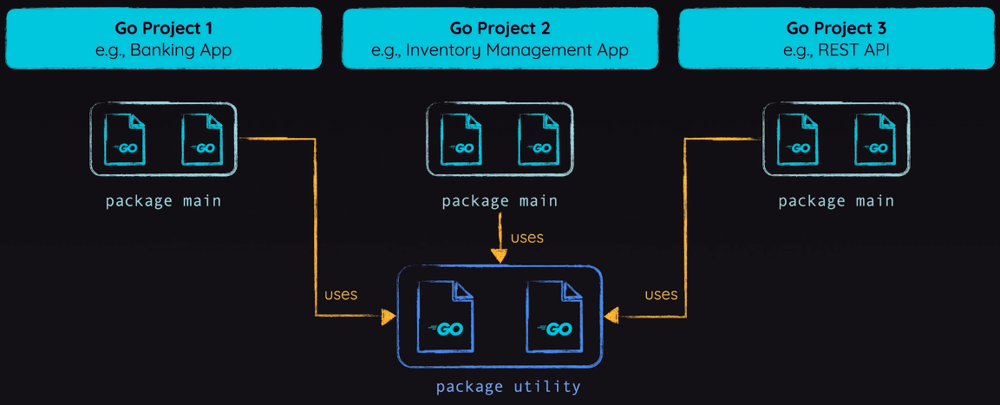

We see in our "Hello World" program `package main`, but what does that mean and what's going on behind the scenes. A **package** just groups together one or more `*.go` files.

`app.go`:
```go
package main  
  
import "fmt"  
  
func main() {  
    fmt.Print("Hello World")  
}
```

The main package is an executable package with one or more `*.go` files in which there is exactly one driver function `func main()` somewhere in the package. All files always need to declare a package, and a Go application must have at least 1 package (can be any name, typically `main`). Packages are also reusable across projects/apps. For example, the `fmt` package from the [Go Standard Library](https://pkg.go.dev/std).



Let's create another file `second.go` in the same package `main`:

`second.go`:
```go
package main
```

We use package name `main` because we are building an executable program. During development, we can run it with `go run`, which requires Go to be installed. In practice, Go programs are usually compiled with go build into a standalone binary that can run on any system without requiring Go.

If we try and build our project now with both `app.go` and `second.go`, we get an error:

```sh
go: cannot find main module, but found .git/config in /Users/tylerliquornik/Desktop/personal/golang-fundamentals
        to create a module there, run:
        cd .. && go mod init
```

The compiler is complaining about a missing `main` module. A **module** is just a grouping of one or more packages. In many cases, a module is the entire Go project. Let's follow the instructions and run `go mod init`. We still get an error:

```sh
go: cannot determine module path for source directory /Users/tylerliquornik/Desktop/personal/golang-fundamentals/2-go-essentials (outside GOPATH, module path must be specified)

Example usage:
        'go mod init example.com/m' to initialize a v0 or v1 module
        'go mod init example.com/m/v2' to initialize a v2 module

Run 'go help mod init' for more information.
```

A module path is the unique identifier for your Go project and serves as the root import path for all its packages. It’s usually set to your repository URL so others (and your own code) can import and fetch it consistently. Let’s run `go mod init github.com/Tyler-Liquornik/golang-fundamentals` at the root of this repository, and then we can build and run individual packages within the module.

> You can use whatever dummy name if you want, like `example.com/first-app` if there's no repository set up.

We get the following at the root:

`go.mod`:
```go
module github.com/Tyler-Liquornik/golang-fundamentals  
  
go 1.26.1
```

After running `go build` in `2-go-essentials`, we get a platform-specific executable that can be run without Go installed. On macOS or Linux, this is a Unix binary; on Windows, it’s a .exe file. This makes Go easy to work with across platforms, since you can build binaries for different target systems.

If you run go build in a module without any package main, Go will compile the code but won’t produce an executable, since only packages named `main` can be built into runnable programs. If you never anticipate needing to run a package and only to import it elsewhere, it needs a uni

> There can only be one `pakcage` per file system directory, which makes things simpler. You can of course have sub-packages if needed.